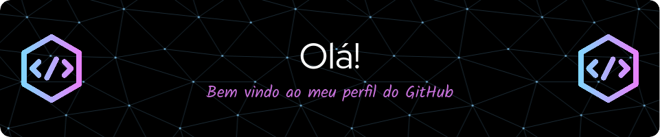

## 👨🏼‍💻 Quem sou eu 👨🏼‍💻

  Olá! Meu nome é Héber. Tenho 6 anos de experiência e atualmente, trabalho como <b>Desenvolvedor de Software</b>, <b>Analista de Sistemas</b>, e com <b>desenvolvimento e arquitetura e documentação de RPA AA360</b>.
  Utilizo as tecnologias: <b>Angular, TypeScript | JavaScript, Microsoft SQL Server (SQL), Mongodb, Google Cloud, Azure, Automation Anywhere, Uipath</b> e outras ferramentas.
  Desenvolvi um template de Bot para loops transacionais que facilita monitorias e manutenções com relatórios automáticos via e-mail e Telegram.

## 🗂️ O que você encontra no meu Github 🗂️

👨🏼‍💻 Projetos de frontend

🤖 Projetos de robôs para mercado financeiro

🖥️ Alguns códigos aleatórios

⚙️ Projetos pessoais

👨🏼‍💻 Resumos de cursos e conteúdos que já estudei

## 🌟 Tecnologias que mais utilizo no momento 🌟

## ⭐ Tecnologias que já utilizei ou já estudei ⭐

## 📊 Status sobre o que eu ando fazendo por aqui 📊

<!-- 

  
  

<table>
  <tr>
    <td align="center">
      
    </td>
    <td align="center">
      
    </td>
  </tr>
</table> -->

<!--  -->

## 👉 Entre em contato comigo:

   
   
   
   

